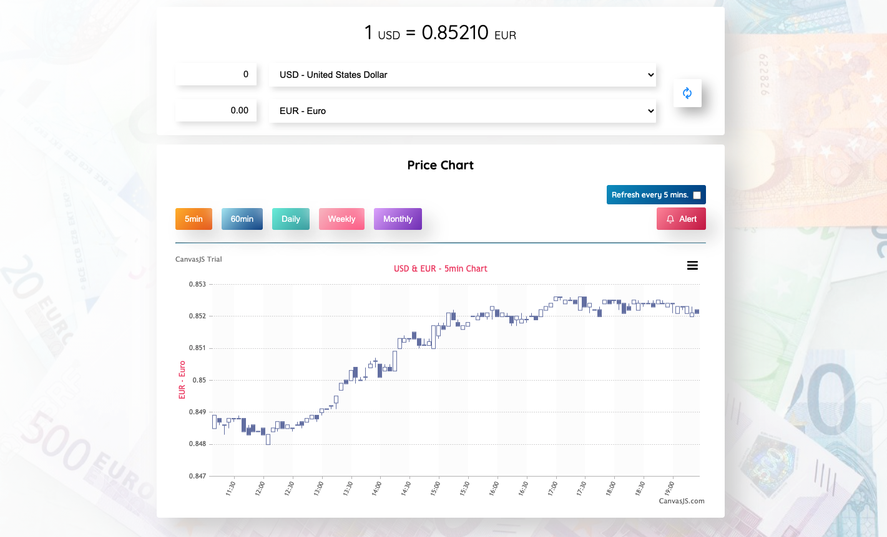

# Currency Converter



### [Live Site](https://currency-converter-hsnakk.netlify.app/)

## Introduction

+ This is a code repository for Currency Converter Application.
+ It gives currency rate related to selected currency pair among from 58 currencies. 
+ It starts automatically with USD&EU pair currency rate and 5 minute chart.
+ If you change one of the pair or both, it changes automatically 5 minute chart too. 
+ It is also possible to see historical data with the help of charts (5min, 60min, daily, weekly and monthly).
+ It gets the financial data from Alpha Vantage Api. (Because of free trial API you can make maximum 5 requests in a minute)
+ With the help of CanvasJS candlestick chart it is easy to show the historical data as well. 
+ It is also possible to set up an alert price, which makes 5s sound at the alert price.


This application was created with React, TypeScript and Redux-Toolkit

<a href="#" ></a>
<a href="#" ></a>
<a href="#" ></a>


Setup:
- run ```npm i && npm start```  to start the application.
